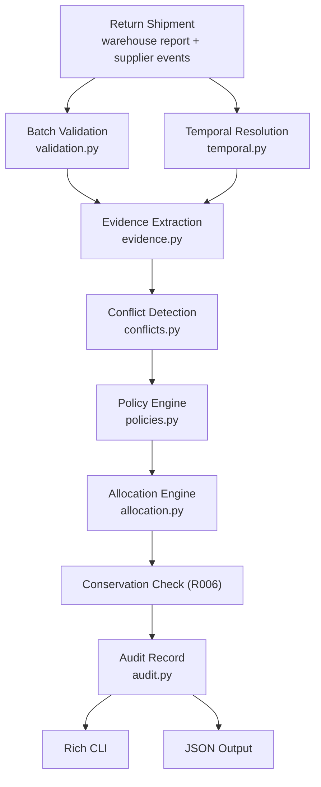
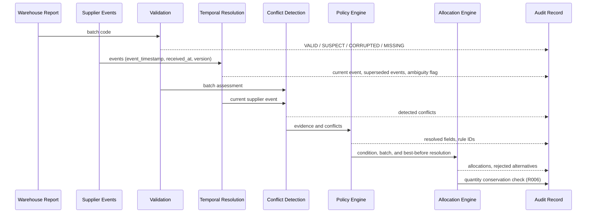
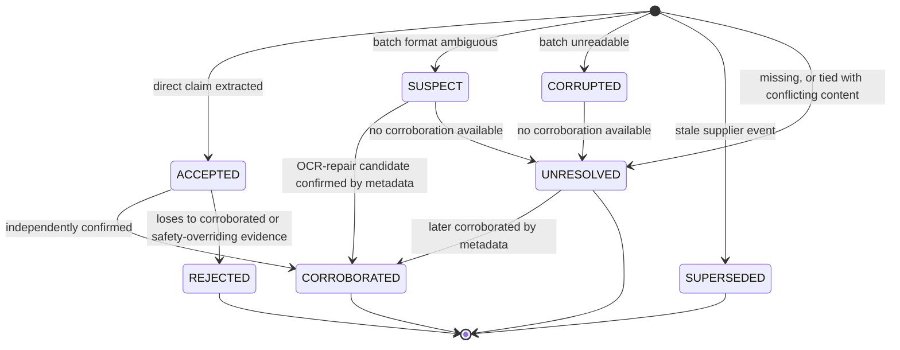
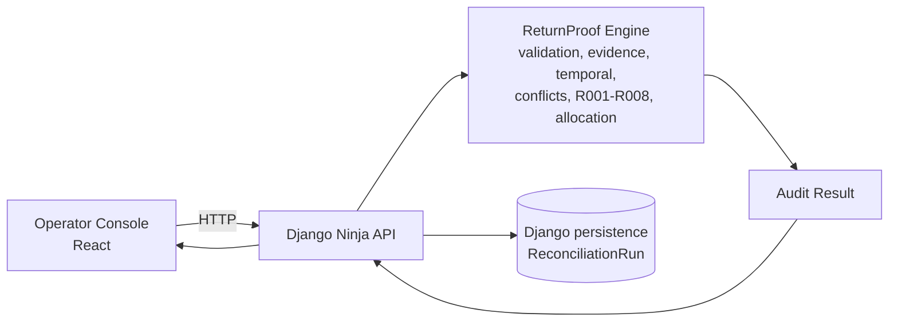

# ReturnProof

**Evidence-driven reconciliation for conflicting stock returns.**

ReturnProof is a deterministic engine that reconciles a returned shipment
when a warehouse's physical inspection and a supplier's credit-note events
describe it differently. It resolves each field on its own evidence, not by
picking one source to trust overall, and produces a routing decision, a
best-before bucket, a commercial credit outcome, and a full audit trail for
every item.

```text
Warehouse Inspection + Supplier Events
                  |
         Evidence Reconciliation
                  |
       Restock / Scrap / Quarantine
                  |
          Auditable Decision
```

## The problem

A returned shipment carries two independent, incomplete accounts of the
same physical stock.

The warehouse report has direct physical observation: SKU, condition,
damage, quantity actually received, a scanned batch code, a read
best-before date. Its weaknesses are physical too, scanner corruption,
damaged labels, manual-entry mistakes.

The supplier's credit-note events carry a different kind of knowledge:
their own batch record, an acknowledged quantity, credit eligibility and
quantity, a disposition instruction, a business event timestamp, and the
time the message arrived. Its weaknesses are informational, no direct
observation of current physical state, events that arrive out of order or
get corrected, and a commercial incentive that doesn't always point toward
paying out more credit.

Neither account is reliable end to end, and picking one to trust globally
fails in an obvious way: trusting the warehouse always means restocking a
shipment whose batch code came out of the scanner garbled, trusting the
supplier always means accepting a RESTOCK instruction against cartons the
warehouse just logged as crushed and leaking.

The actual question isn't "which source is correct." It's "which evidence
is authoritative for this specific decision." Physical condition and a
supplier's commercial credit terms are not the same kind of fact, and
resolving one says nothing about how to resolve the other.

## Why this is different

Most systems in this shape end up as one of two things: a fixed priority
order between the two sources, or a single trust score per source. Both
collapse the moment the sources disagree on different fields for
different, legitimate reasons.

ReturnProof resolves conflicts at the level of the individual claim.
Condition, batch identity, best-before, quantity, and credit eligibility
each carry their own authority policy, checked in `policies.py`. The same
item can have the warehouse win the condition decision while the supplier
wins the batch decision, because that's genuinely how much each source
knows about that particular field, not because of a global ranking.

## What it produces

For every item in a return shipment:

- a physical routing decision, RESTOCK, SCRAP, or QUARANTINE, allocated
  per quantity rather than once per item
- a best-before month bucket, only when identity is resolved enough to
  trust it
- a commercial credit outcome, resolved independently of physical routing
- every conflict detected between the two sources, by type
- a full evidence trail: what was accepted, corroborated, rejected,
  superseded, or left unresolved, and why
- the specific rule IDs that fired
- the alternative routes that were considered and rejected, and why
- an explicit quantity-conservation check
- the same decision rendered as a readable terminal report, structured
  JSON, or an investigable web workspace (the Operator Console, see below)

## Use cases

The pattern generalizes wherever two operationally independent systems
report on the same physical goods and disagree. In particular:

- retail and FMCG stock returns
- distribution-center receiving reconciliation
- supplier credit and chargeback disputes
- batch and lot traceability at the point of return
- expiry and best-before allocation for restocked goods
- routing exceptions that need a defensible "hold for review" outcome
  instead of a forced guess

This is not built or verified against regulated or safety-critical
production workflows, pharmaceutical returns being the obvious example.
The underlying evidence-arbitration approach, resolve per field, corroborate
before trusting, escalate uncertainty instead of guessing, could plausibly
generalize to adjacent inventory domains, but that would need real
integration and domain-specific policy work first.

## How it works



The same sequence, showing what each stage hands to the audit record:



Every stage's output stays in the audit record. Nothing gets used and then
discarded, a claim that lost still shows up with its status and the reason
it lost.

### Evidence lifecycle

Each field value from each source becomes an evidence claim carrying a
status, not a source-level trust score.



## Core principle: trust claims, not sources

There is no per-source trust score anywhere in the codebase. Authority is
assigned per decision domain, in one table at the top of `policies.py`:

| Decision domain | Typical authority |
| --- | --- |
| Physical condition | Warehouse |
| Damage type | Warehouse |
| Quantity physically received | Warehouse |
| Supplier acknowledged quantity | Supplier |
| Batch identity | Corroborated evidence, no default owner |
| Best-before | Corroborated evidence, tied to batch identity |
| Credit eligibility | Supplier |
| Credit quantity | Supplier |
| Disposition instruction (RESTOCK/SCRAP/QUARANTINE) | A preference weighed against physical evidence, not authoritative alone |
| Physical routing | Derived by policy, no single owner |

These are domain policies about who typically knows a given fact best, not
a claim that one system is generally more trustworthy. Batch identity and
best-before deliberately have no default owner: they're resolved from
whichever evidence corroborates, and if nothing does, the field stays
unresolved rather than falling back to a default source.

## Decision rules

Implemented in `policies.py`, `conflicts.py`, and `allocation.py`. Every
rule ID that actually fires on an item appears in that item's audit
output, nothing is tagged for effect.

| Rule | Name | What it does |
| --- | --- | --- |
| R001 | PHYSICAL_CONDITION_AUTHORITY | Warehouse direct observation has authority over supplier routing preference for physical condition. |
| R002 | INVALID_EVIDENCE_LOSES_AUTHORITY | A corrupted or suspect claim can't win a decision just because of who sent it. |
| R003 | BATCH_CORROBORATION | A supplier batch can resolve a bad warehouse batch, but only once checked against independent product metadata. |
| R004 | SUPPLIER_TEMPORAL_ORDERING | Supplier state is resolved by business event time or version, never by message arrival order. |
| R005 | PHYSICAL_SAFETY_OVERRIDE | Confirmed unsafe physical damage blocks a restock, no matter what the supplier instructed. |
| R006 | QUANTITY_CONSERVATION | Scrap plus restock plus quarantine has to equal exactly what the warehouse received. |
| R007 | UNCERTAINTY_ESCALATION | Unresolved identity, safety, or disposition routes the affected stock to quarantine instead of guessing. |
| R008 | COMMERCIAL_OPERATIONAL_SEPARATION | Credit eligibility never decides physical routing, and physical routing never decides credit eligibility. |

## Conflict types

Detected in `conflicts.py`, before any resolution happens. Detection only
records what disagrees and why, resolving it is the policy engine's job.

**CONDITION_DISAGREEMENT.** Either direction: the warehouse reports
anything other than GOOD while the current supplier event instructs
RESTOCK, or the warehouse reports GOOD while the supplier instructs SCRAP.
Both directions are checked, flagging only one would itself be a bias
toward whichever source that omission favored.

**BATCH_MISMATCH.** The warehouse batch code is unusable, or the
warehouse and supplier codes disagree once both are normalized.

**QUANTITY_OR_ELIGIBILITY_DISPUTE.** Three distinct disputes under one
type, never folded into a single number. Received quantity against
acknowledged quantity is a receiving-count disagreement. Damaged quantity
against credit quantity is a separate commercial-scope disagreement. And a
supplier event crediting more than it acknowledges receiving is an
internal inconsistency on the supplier's own data, flagged independently
of anything the warehouse reported.

**SUPPLIER_STATE_AMBIGUOUS.** Two or more supplier events tie on ordering,
same version, or same event time with no version, with genuinely
conflicting content. See Temporal Reasoning below.

## Batch corruption

`validation.py` classifies every batch code as VALID, SUSPECT, CORRUPTED,
or MISSING, and never mutates the raw value while doing it.

The default grammar (two letters followed by four to six digits) is a
synthetic convention for this project, not a real supplier's format. A
SKU can override it entirely with its own regex through
`ProductMetadata.batch_pattern`, so the grammar isn't hardcoded globally,
though a custom pattern gets no repair-candidate generation, the digit
positions of an arbitrary format aren't known.

Under the default grammar, non-alphanumeric noise like `BA?9O2` is
CORRUPTED outright, nothing about it is safely repairable. A code like
`BA729I` is SUSPECT: the `I` sits where a digit belongs and reads like an
OCR misread of `1`. A normalized candidate (`BA7291`) is computed and
recorded, but it stays a candidate, it only becomes the resolved value if
independently confirmed against product metadata, never on its own.

If the warehouse and supplier batch codes are both individually
well-formed but disagree, neither wins automatically. Resolution falls to
whichever one, if either, matches known batch metadata for that SKU. If
both match, or neither does, the field stays UNRESOLVED rather than being
decided by which source reported it.

## Temporal reasoning

`temporal.py` orders supplier state by `event_timestamp` (when the
supplier says the state became true), or by `version` when every event for
an item carries one. `received_at` (when the message arrived) is retained
as audit metadata and never orders anything.

An event that arrives after a logically newer one doesn't overwrite it,
and it's marked SUPERSEDED with the reason on record. Two events can
legitimately tie on the ordering key. If they agree on every
decision-relevant field, it's one event delivered twice, deduplicated, not
a conflict. If they disagree, there's no defensible winner: the state is
reported SUPPLIER_STATE_AMBIGUOUS rather than picked by array position or
by whichever `event_id` happens to sort last.

## Compound failure

`examples/compound_failure.json` is the scenario that has to work for any
of this to mean something, both mandatory failure modes hitting the same
item.

The warehouse scans batch `BA?9O2` for a milk return, unreadable, CORRUPTED.
Two supplier events exist for the item: one instructs SCRAP with an event
time of 13:55 but arrives at 14:05, the other instructs RESTOCK with an
event time of 14:02 but arrives earlier, at 13:58. Ordering by arrival
would land on the stale SCRAP event. ReturnProof orders by event time,
accepts the RESTOCK event as current, and marks the SCRAP event SUPERSEDED.

Independently, the supplier's batch code `BA1902` is checked against the
return's product metadata for SKU `MILK-01`, matches, and is accepted as
CORROBORATED (R002, R003). Best-before resolves to `2026-10` from that
same metadata.

Independently again, the warehouse's own physical inspection still
governs the damaged units: 6 of the 24 are DAMAGED_UNSAFE, routed to SCRAP
under R005 regardless of what either supplier event instructed. The
remaining 18 route to RESTOCK under the resolved batch and best-before
bucket. R006 confirms 6 plus 18 equals the 24 units received.

The accepted event's `credit_quantity` is 4, not 6 and not 18, resolved
under R008 as its own independent commercial figure rather than derived
from either physical quantity.

```text
resolved:    condition=DAMAGED_UNSAFE  batch=BA1902  best_before=2026-10
allocations: 6 -> SCRAP   18 -> RESTOCK / 2026-10
commercial:  credit_eligible=True  credit_quantity=4
conflicts:   CONDITION_DISAGREEMENT, BATCH_MISMATCH, QUANTITY_OR_ELIGIBILITY_DISPUTE
rules:       R001, R002, R003, R004, R005, R006, R008
```

None of this runs in sequence by necessity. Batch resolution, temporal
resolution, condition routing, and credit resolution each work from their
own evidence and would land on the same result if the other failure
weren't present at all.

## Unresolved compound failure

`examples/compound_unresolved.json` runs the same two mandatory failure
modes, corrupted warehouse batch and out-of-order supplier events, with
the corroborating evidence removed on purpose. Product metadata exists for
the SKU, but doesn't contain the supplier's batch code.

```text
resolved:    condition=GOOD  batch=None  best_before=None
allocations: 15 -> QUARANTINE
conflicts:   BATCH_MISMATCH, QUANTITY_OR_ELIGIBILITY_DISPUTE
rules:       R001, R002, R004, R006, R007, R008
```

Batch identity and best-before both stay UNRESOLVED, and all 15 units of
physically intact stock go to QUARANTINE instead of being restocked on an
unconfirmed guess. The out-of-order events still resolve correctly
underneath that, the stale SCRAP event is still marked SUPERSEDED, it just
doesn't matter for the final routing because identity was never
established. Uncertainty is surfaced, not hidden behind a forced decision.

## Partial routing

One SKU doesn't necessarily receive one disposition. In
`examples/partial_allocation.json`, 20 units arrive with 8 marked
DAMAGED_SALVAGEABLE and 12 intact:

```text
8  -> QUARANTINE  (damage present, not confirmed unsafe or confirmed restockable)
12 -> RESTOCK     (intact, identity resolved)
```

R006 checks `SCRAP + RESTOCK + QUARANTINE == quantity_received` explicitly
on every item and reports PASS or FAIL, it isn't just implied by the
absence of an error.

## Physical vs commercial decisions

Physical routing and supplier credit are resolved on entirely separate
code paths. `allocation.py` never reads a credit field, and the
credit-resolution functions in `policies.py` never touch routing. All four
combinations are valid outcomes:

```text
SCRAP   + credit eligible
SCRAP   + not credit eligible
RESTOCK + credit eligible
RESTOCK + not credit eligible
```

Coupling the two would let a supplier's financial incentive quietly steer
where physical stock goes, which is the exact failure mode this
separation exists to prevent.

## Operator Console

A web application sits on top of the engine described above: an operator
submits or selects a return, and gets back the same decision the CLI
would produce, as an investigable workspace rather than a terminal report.



The engine is still the only place a decision gets made. Django's
`reconciliation` app (`server/reconciliation/services.py`) calls
`returnproof.validation.parse_shipment` and `returnproof.reconciler.reconcile`
directly, the exact functions the CLI calls, and does nothing with the
result except persist it and hand it back as JSON. Neither Django nor
React re-implements conflict resolution, batch corroboration, temporal
ordering, allocation, or any of R001 through R008. A `ReconciliationRun`
row is a snapshot of what was submitted and what the engine decided, an
application history record, not a second source of truth: `input_payload`
and `audit_report` are stored and returned unmodified.

The CLI is unaffected by any of this. `returnproof reconcile ...` still
runs standalone, with no Django process involved, because the web layer
is a consumer of the `returnproof` package, not a dependency of it.

The workspace for a single return is organized around four questions, in
roughly this order of what an operator needs first: what's the final
status and routing, what conflicts were found, what did each source claim
side by side, and then (progressively deeper) which field-level decision
won and why, the supplier's timeline, the commercial outcome, the
conservation check, which rules fired, and the full evidence audit with
the raw JSON underneath it for anyone who wants to check the console isn't
hiding anything.

Two scenarios are worth loading side by side to see the point of this
project made concrete in the UI: `compound_failure`, which resolves both
mandatory failure modes to a confident decision, and `compound_unresolved`,
the same two failure modes with the corroborating evidence stripped out,
which resolves to an explained `QUARANTINE` / "Requires review" instead of
a guess.

## Repository layout

```text
returnproof/
├── README.md
├── pyproject.toml
├── examples/
│   ├── simple_condition_conflict.json
│   ├── batch_corruption.json
│   ├── out_of_order_supplier.json
│   ├── quantity_dispute.json
│   ├── partial_allocation.json
│   ├── compound_failure.json
│   └── compound_unresolved.json
├── src/
│   └── returnproof/
│       ├── __init__.py
│       ├── __main__.py
│       ├── cli.py            # Typer + Rich presentation, no decision logic
│       ├── models.py         # input schema (Pydantic)
│       ├── enums.py          # shared vocabulary
│       ├── validation.py     # batch code classification
│       ├── evidence.py       # claim extraction
│       ├── temporal.py       # supplier event ordering
│       ├── conflicts.py      # conflict detection
│       ├── policies.py       # every decision rule
│       ├── allocation.py     # partial routing + conservation check
│       ├── reconciler.py     # pipeline orchestration
│       ├── audit.py          # audit record shapes
│       └── exceptions.py
├── tests/                    # engine tests, no Django involved
│
├── server/                   # Operator Console API and persistence
│   ├── manage.py
│   ├── config/                # Django project settings, urls
│   └── reconciliation/        # the only app: models, api.py (Ninja), services.py, tests/
│
└── web/                      # Operator Console frontend
    ├── src/
    │   ├── routes/             # ReturnsQueue, NewReconciliation, ReturnWorkspace
    │   ├── components/         # evidence, conflicts, timeline, routing, decision, audit, shared
    │   ├── lib/api/             # fetch client + TanStack Query hooks
    │   └── types/               # TypeScript mirrors of the engine's audit shapes
    └── e2e/                    # Playwright smoke tests against the real API
```

## Installation

The engine and CLI install on their own:

```bash
git clone https://github.com/parthrohit22/returnproof.git
cd returnproof

python -m venv .venv
source .venv/bin/activate
pip install -e ".[dev]"
```

Requires Python 3.11 or newer. This alone is enough for
`returnproof reconcile ...` and `pytest` (the engine's own test suite).

The Operator Console additionally needs Node 20+ for the frontend:

```bash
cd web
npm install
```

`pip install -e ".[dev]"` already installs Django and Django Ninja, they're
runtime dependencies of the `returnproof` distribution so the API server
and the CLI share one environment. Running the API server itself needs one
more step, a database:

```bash
python server/manage.py migrate
```

## Usage

```bash
returnproof reconcile examples/compound_failure.json
```

or without the console script on `PATH`:

```bash
python -m returnproof reconcile examples/compound_failure.json
```

Machine-readable output, rendered from the same decision, not recomputed:

```bash
returnproof reconcile examples/compound_failure.json --json
```

The uncertainty case:

```bash
returnproof reconcile examples/compound_unresolved.json
```

## Running the Operator Console

Two processes, in development: Django serves the API, Vite serves React
and proxies `/api` requests to Django so there's no CORS configuration to
maintain locally.

```bash
# terminal 1
python server/manage.py migrate   # once, or after pulling new migrations
python server/manage.py runserver

# terminal 2
cd web
npm run dev
```

Open `http://localhost:5173`. The Returns queue starts empty until a
reconciliation is run, from a built-in scenario, pasted JSON, or an
uploaded `.json` file.

For a local production-style preview instead of two dev processes, build
the frontend and let Django serve it:

```bash
cd web && npm run build && cd ..
python server/manage.py runserver
```

`server/config/urls.py` serves `web/dist/index.html` for any route that
isn't `/api/` or `/admin/` once that build exists. This is a local preview
convenience, not a production deployment story, see Limitations.

Django admin (`http://localhost:8000/admin/`, needs
`python server/manage.py createsuperuser`) exposes `ReconciliationRun` rows
for developer inspection. It isn't part of the product.

## API

Django Ninja serves a typed API under `/api/v1/`, with interactive
documentation at `http://localhost:8000/api/v1/docs`.

| Endpoint | Purpose |
| --- | --- |
| `GET /api/v1/health` | Liveness check |
| `GET /api/v1/examples` | List the real filenames under `examples/` |
| `GET /api/v1/examples/{name}` | One example's contents, name checked against an allowlist built from the actual directory, never concatenated into a path |
| `GET /api/v1/reconciliations` | List persisted runs, most recent first |
| `POST /api/v1/reconciliations` | Validate and reconcile a return shipment, persist the result |
| `GET /api/v1/reconciliations/{id}` | One run's full input and audit report |
| `DELETE /api/v1/reconciliations/{id}` | Remove a run |

`POST` accepts the same JSON shape `returnproof reconcile` does, validated
by the same `parse_shipment` function, not a second schema. A validation
failure comes back as a structured `422`:

```json
{
  "error": "validation_error",
  "message": "The return payload is invalid.",
  "details": [
    { "path": "warehouse_report.items.0.damaged_quantity", "message": "..." }
  ]
}
```

`404` for an unknown example or reconciliation id, `500` (logged
server-side, never a traceback in the response) for anything unexpected.

## Example scenarios

| Fixture | Demonstrates |
| --- | --- |
| `simple_condition_conflict.json` | Warehouse-confirmed unsafe damage overriding a supplier RESTOCK instruction |
| `batch_corruption.json` | A corrupted warehouse batch resolved through supplier corroboration |
| `out_of_order_supplier.json` | Business event time winning over message arrival order |
| `quantity_dispute.json` | Physical and commercial quantities staying independently represented |
| `partial_allocation.json` | One SKU split across QUARANTINE and RESTOCK by condition |
| `compound_failure.json` | Both mandatory failure modes together, resolved with evidence |
| `compound_unresolved.json` | Both mandatory failure modes together, with insufficient evidence to resolve identity |

## Example output

```text
CONFLICTS
  ! CONDITION_DISAGREEMENT: warehouse reports condition DAMAGED_UNSAFE but supplier event evt-2
    instructs RESTOCK
  ! BATCH_MISMATCH: warehouse batch 'BA?9O2' does not match supplier batch 'BA1902'
  ! QUANTITY_OR_ELIGIBILITY_DISPUTE: warehouse recorded 6 damaged units, supplier credits 4

FINAL ALLOCATION
  6   SCRAP    -        DAMAGED_UNSAFE confirmed by warehouse inspection, unsafe for restock
                         regardless of supplier instruction
  18  RESTOCK  2026-10  intact stock with resolved batch identity and best-before date

COMMERCIAL  credit_eligible=True  credit_quantity=4
INTEGRITY   24 received, 24 allocated  PASS
RULES APPLIED  R001, R002, R003, R004, R005, R006, R008
```

`--json` returns the same `ReturnAuditReport`, with every evidence claim,
resolved field, conflict, allocation, and rejected alternative available
for a downstream system to consume.

## Testing

```bash
pytest
```

86 tests across validation, evidence extraction, temporal ordering,
conflict detection, batch resolution, quantity handling, partial
allocation, the conservation invariant, both compound scenarios, and the
CLI. High-value cases beyond the basic ones:

- permutation invariance, the same supplier events in every possible
  array order resolve to the same state
- genuinely tied supplier events staying unresolved instead of being
  decided by event id
- duplicate event deliveries collapsing without a false conflict
- a SKU-specific `batch_pattern` overriding the default grammar
- a corrupted warehouse batch against an uncorroborated supplier batch
  staying unresolved even when product metadata exists for the SKU, just
  not for that code
- two format-valid but conflicting batch codes never resolved by guessing
- unresolved best-before blocking a restock despite an explicit supplier
  RESTOCK instruction
- a supplier event crediting more than it acknowledges, surfaced without
  affecting physical routing
- over-allocation and under-allocation both failing the conservation
  check, checked directly against the invariant function
- the human and JSON outputs agreeing on every material value for the
  same input

```bash
ruff check src/ tests/ server/
```

### API and frontend tests

The API has its own suite, `server/reconciliation/tests/`, run from
`server/` (it needs `DJANGO_SETTINGS_MODULE`, kept in `server/pytest.ini`
rather than the root one so the engine's own tests never need Django
installed to run):

```bash
cd server && pytest
```

31 tests covering every endpoint, the allowlisted example lookup
(including path-traversal attempts), and the property this layer exists to
guarantee: `test_create_reconciliation_matches_direct_engine_output` calls
the engine directly and asserts the API's response matches it field for
field, the API is an adapter, not a second engine.

The frontend has unit/integration tests (Vitest + React Testing Library)
and a small set of end-to-end tests (Playwright) against the real Django
API and a real browser:

```bash
cd web
npm test           # Vitest
npm run test:e2e   # Playwright, starts Django and Vite itself
```

The Vitest suite covers the resolvable and unresolved compound flows,
structured validation error rendering, physical/commercial separation in
the UI, and API-unreachable recovery, against real captured API responses
(`web/src/test/fixtures/`), not invented data. Playwright drives all seven
example scenarios through a real browser against the real stack, asserts
zero console errors, and checks that a saved reconciliation survives a
page refresh.

```bash
cd web
npm run lint        # oxlint
npm run typecheck   # tsc --noEmit, strict mode
npm run build       # production build
```

## Why no LLM decides anything

Every routing, batch, quantity, and credit decision in ReturnProof is
deterministic and reproducible. Given the same input, it always produces
the same routing, the same batch resolution, and the same rule set, and
that's checked directly in the test suite. That property is the point:
reconciliation decisions need to be reproducible, testable against fixed
cases, and explainable in terms of a specific rule and a specific piece of
evidence, not a model's output on a given day.

An explanation layer that narrates an already-resolved audit record in
natural language would sit strictly downstream of the decision. Nothing
like that exists in this repository yet, and it would never be allowed to
determine a route, a batch identity, or a quantity.

## Design principles

- Evidence is resolved per field, never per source
- Authority is contextual, assigned by decision domain, not by reputation
- Confirmed physical safety overrides a commercial routing preference
- Invalid evidence loses authority locally, it doesn't hand authority to
  whatever's left
- Event time is not arrival time
- Quarantine is a valid, deliberate decision, not an unhandled case
- Every physical unit is accounted for, checked explicitly, not assumed
- A decision that can't be explained with a specific rule and specific
  evidence isn't finished

## Limitations

The default batch grammar and its OCR confusion map are both synthetic,
built for this project rather than sourced from a real supplier's format.
A per-SKU `batch_pattern` override exists, but a real deployment would
still need the actual batch conventions in use.

Product metadata in the examples is a small, hand-written list of known
batches per SKU. Real catalog data at scale would need proper lookup and
probably fuzzy matching instead of exact string comparison.

The condition-by-supplier-instruction policy matrix is intentionally
incomplete. RESTOCK against damaged or unknown condition, and SCRAP
against confirmed-good condition, are both handled because they carry
real risk (restocking unsafe stock, or destroying sound stock). A supplier
QUARANTINE preference against warehouse-confirmed GOOD stock isn't
separately handled and currently proceeds to RESTOCK if identity is
resolved.

There's no warehouse system integration and no supplier API integration.
Input is a single JSON document per return, submitted through the CLI or
the Operator Console's API.

There's no probabilistic model. Every confidence signal is a category,
DIRECT, CORROBORATED, INFERRED, or UNRESOLVED, not a number, a fabricated
percentage would be less honest than no number at all.

There's no human review workflow. QUARANTINE is the terminal state this
system produces for uncertain stock, "Requires review" is a label in the
Operator Console, not a queue, an approval flow, or anything a person can
act on inside the app, what happens to a quarantined item afterward is
outside this system's scope.

The Operator Console's persistence is SQLite, one `ReconciliationRun` table
storing a snapshot of the input and the engine's output, not a normalized
evidence model, and it's a plain database, not tamper-evident, anyone with
database access can edit a row. There's no authentication on the API or
the console, it's a single-operator local tool. The `PARTIAL` summary
status suggested for the Returns queue was deliberately not built, an
"item partly resolved" label would need a rule for what counts as partial
that the engine itself doesn't define, every run is either `RESOLVED` or
`REQUIRES_REVIEW`. Serving the built frontend through Django
(`npm run build` then `runserver`) is a local preview convenience using
Django's development static file serving, not a production deployment
setup.

## Future work

None of the following is implemented. Listed as directions, not claims.

- Configurable policies, so the field-authority table and batch grammar
  could be swapped per deployment without touching code
- Tamper-evidence on top of the persistence that already exists, hashing
  each `ReconciliationRun` against the one before it so an edited row
  breaks a checkable chain, not just storing the record
- An actual human review workflow behind QUARANTINE and "Requires review",
  the Operator Console currently only labels the state, it doesn't queue
  or route it to anyone
- Supplier webhook ingestion, with real idempotency and event
  authenticity guarantees, in place of a single JSON document submitted
  through the CLI or the API
- Real batch master-data integration in place of the hand-written fixture
  metadata
- Policy versioning and decision replay, re-running a past decision
  against the policy version that was actually in effect
- Property-based testing over the allocation and temporal-ordering logic,
  particularly the conservation invariant
- An optional explanation layer that narrates an already-resolved audit
  record, strictly downstream of the decision
- Authentication on the API and console, and a database beyond SQLite,
  if this ever needed to run as anything other than a single-operator
  local tool
